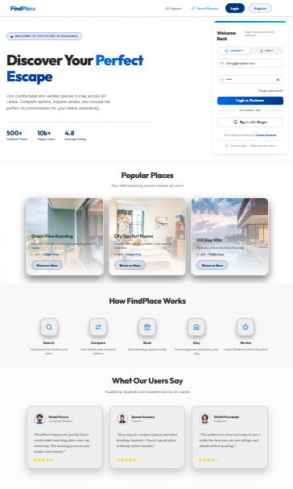
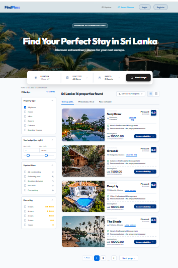
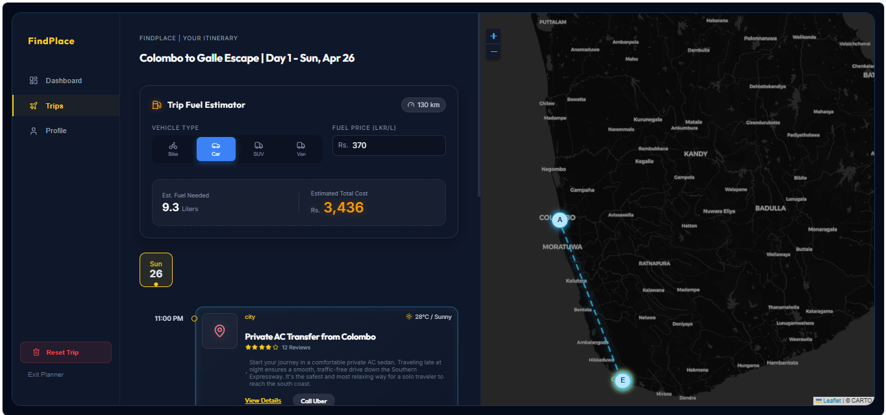
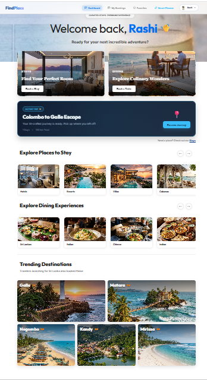
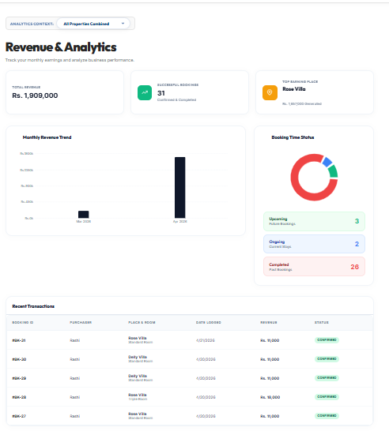
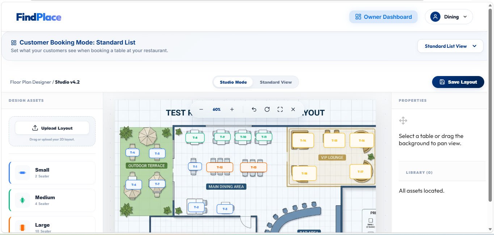

# 📍 FindPlace - "Find Places, Book Easily"
### *The Ultimate AI-Powered Booking Platform for Sri Lanka*

FindPlace is a premium, high-end web platform designed to revolutionize the way travelers discover and book accommodations and dining experiences in Sri Lanka. It combines modern aesthetics with cutting-edge AI technology to provide a seamless user journey.

---

## ✨ Key Features

### 🤖 Smart Planner (AI-Powered)
- **Generative AI Integration:** Uses Google Gemini API to craft personalized multi-day travel itineraries.
- **Dynamic Expiration:** Plans automatically expire and reset once the trip duration is over.
- **Vibe-Based Planning:** Tailors trips based on user moods, budgets, and dietary needs.

### 🍽️ Next-Gen Dining & Table Management
- **Visual Floor Plan Designer:** Owners can design their restaurant floor plans with an interactive 2D drag-and-drop tool.
- **Real-time Reservations:** Book specific tables with instant availability updates and status tracking.
- **Digital PDF Menus:** High-end integrated PDF viewers for professional restaurant menus.

### 🏨 Premium Stays & Accommodation
- **360° Virtual Tours:** Immersive room previews using equirectangular panoramic technology for a realistic experience.
- **Smart Filtering:** Advanced search for Hotels, Resorts, Villas, and Cabanas with district-based filtering.
- **Owner Dashboard:** Complete revenue analytics, booking management, and property control for multiple business types.

### 🎨 Design & UI
- **Luna Theme:** A signature high-fidelity dark/glassmorphic design with premium aesthetics.
- **Responsive Layouts:** Perfectly optimized for all devices with smooth Framer Motion animations.

---

## 🛠️ Technology Stack

| Layer | Technology Used |
| :--- | :--- |
| **Frontend** | React (Vite), Framer Motion, Lucide React, Axios |
| **Backend** | Node.js, Express.js |
| **Database** | MySQL |
| **AI Engine** | Google Gemini (Generative AI) |
| **Security** | JWT Authentication, Bcrypt Hashing |
| **Media** | Multer (File Uploads), 360° VR Viewer |

---

## 🚀 Getting Started

### 1. Prerequisites
- Node.js installed
- MySQL Server running
- Gemini API Key (from Google AI Studio)

### 2. Backend Setup
```bash
cd backend
npm install
# Create a .env file and add:
# DB_HOST, DB_USER, DB_PASS, DB_NAME, JWT_SECRET, GEMINI_API_KEY
node server.js
```

### 3. Frontend Setup
```bash
cd frontend
npm install
npm start
```

---

## 📸 Screenshots

### 🏠 Home & Discovery
| Login & Welcome | Search Experience |
| :---: | :---: |
|  |  |

### 🤖 AI Smart Planner


### 📊 Dashboard & Analytics
| Customer Dashboard | Owner Analytics |
| :---: | :---: |
|  |  |

### 🛠️ Advanced Tools
| 2D Visual Designer | 360° Virtual Tour |
| :---: | :---: |
|  |  |

---

## 📄 License
This project is developed as part of a high-end travel tech study. All rights reserved.

---

**Developed by [jprsavindya1](https://github.com/jprsavindya1)**  
*Bringing the future of tourism to Sri Lanka.*
